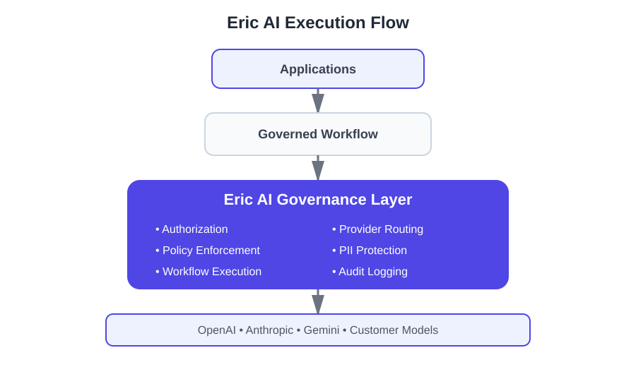

# Rod Bridges

**Senior Software Engineer | Founder & CTO, Eric AI**

Building enterprise AI platforms, backend infrastructure, and governed AI workflows.

📍 Denver, CO

🌐 https://ericaicontrol.dev

---

# Eric AI

## One Governance Layer. Every Workflow. Any Model.

Modern organizations rarely have a single AI application.

They have customer-facing assistants, internal copilots, document workflows, automation services, and AI-powered business applications that evolve independently. As AI adoption grows, governance often becomes fragmented across applications, teams, providers, and policies.

Eric provides a centralized execution platform for enterprise AI.

Organizations define workflows once and govern execution consistently across applications, teams, and AI providers. Applications invoke workflows through Eric, where authorization, policy enforcement, validation, provider routing, PII protection, and audit logging are applied before requests reach an AI model.

Learn more:

https://ericaicontrol.dev

---

# Platform Capabilities

- Enterprise AI workflow governance
- Policy enforcement & authorization
- Provider abstraction
- Workflow execution
- Multi-provider AI architecture
- Audit logging & observability
- BYOK (Bring Your Own Key)
- AI execution infrastructure

---

# Execution Flow

Applications invoke governed workflows. Eric applies policy, routing, validation, and auditing before execution reaches an AI provider.

---

# Current Technical Focus

### Artificial Intelligence

- Enterprise AI Platforms
- AI Governance
- MCP
- Agentic AI
- RAG
- AI Evaluation
- Tool Calling

### Backend Engineering

- Python
- FastAPI
- TypeScript
- Node.js
- REST APIs
- Redis

### Cloud

- Google Cloud
- Firebase
- Firestore
- Cloud Functions
- Docker

---

# Engineering Philosophy

I enjoy designing backend platforms where correctness, governance, observability, and long-term maintainability matter as much as raw performance.

My focus is building enterprise AI systems that remain predictable, auditable, provider-independent, and operationally reliable as organizations scale.

---

# Public Repositories

Additional Python AI engineering repositories will be added here as they are completed, demonstrating production patterns in FastAPI, MCP, AI evaluation, RAG, Redis, Docker, and enterprise AI infrastructure.
